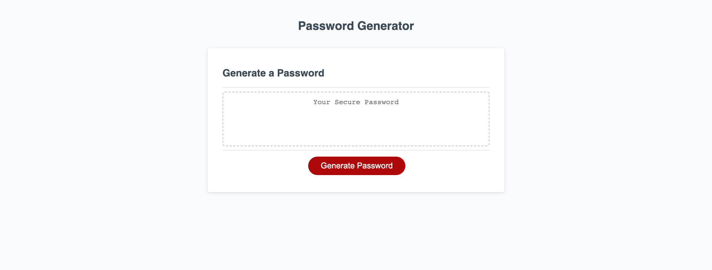

# Challenge3_Password_Generator

## Description

Built a password generator which asks the user for inputs and generates a random password according to the user's requirements.

- The password generator asks the user for the length of the password between 8-128. If a user enters anything less than 8 or greater than 128, the generator will alert the user to enter a length between 8-128.
- If the user enters an non-numeric value for the length it will prompt the user to enter a numeric value.
- It will then prompt the user the following questions:
    - Do you want uppercase letters?
    - Do you want lowercase letters?
    - Do you want numeric characters?
    - Do you want special characters?
- If the user answers no to all the four questions above, it will alert the user to pick at least one option.
- Finally the password generator will generate a random password for the user with the length and the requirements the requested.

# Screenshots

# Link

[Link to Github Repository](https://github.com/vini3076/Challenge3_Password_Generator)

[Link to Deployed page](https://https://vini3076.github.io/Challenge3_Password_Generator/)
